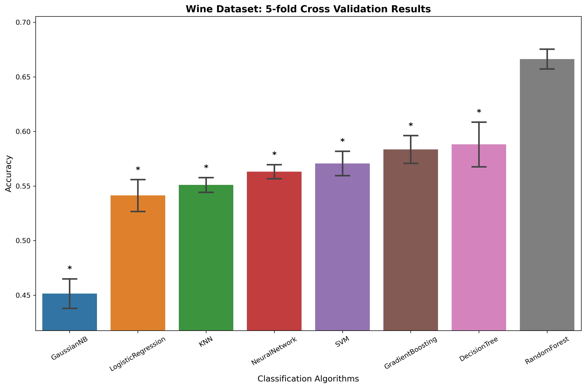
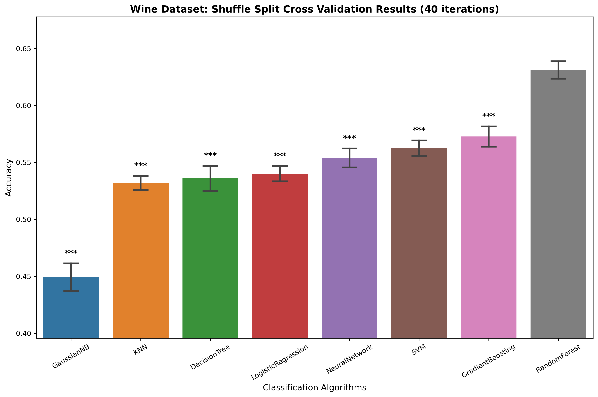

# 교차검증 및 통계 검정 과제

## Q1-Q4: 교차검증 이론

### Q1) 2-fold Cross Validation

2-fold 교차검증에서는 6개 샘플을 2개 폴드로 균등하게 나누어 각 폴드가 한 번씩 테스트셋이 되도록 합니다.

**가능한 분할 방법들:**

**방법 1:**
- Fold 1: Train [0, 1, 2], Test [3, 4, 5]
- Fold 2: Train [3, 4, 5], Test [0, 1, 2]

**방법 2:**
- Fold 1: Train [0, 1, 3], Test [2, 4, 5]
- Fold 2: Train [2, 4, 5], Test [0, 1, 3]

**방법 3:**
- Fold 1: Train [0, 2, 4], Test [1, 3, 5]
- Fold 2: Train [1, 3, 5], Test [0, 2, 4]

### Q2) Stratified 2-fold Cross Validation

Stratified 교차검증에서는 각 폴드에서 클래스 비율(클래스 0: 3개, 클래스 1: 3개)을 유지해야 합니다.

**가능한 분할 방법들:**

**방법 1:**
- Fold 1: Train [1, 2, 4, 5], Test [0, 3]
- Fold 2: Train [0, 3], Test [1, 2, 4, 5]

**방법 2:**
- Fold 1: Train [0, 2, 3, 5], Test [1, 4]
- Fold 2: Train [1, 4], Test [0, 2, 3, 5]

**방법 3:**
- Fold 1: Train [0, 1, 3, 4], Test [2, 5]
- Fold 2: Train [2, 5], Test [0, 1, 3, 4]

### Q3) Shuffle Split Cross Validation (1:1 비율, 2회 반복)

Shuffle Split에서는 매 반복마다 무작위로 50%씩 샘플링하며, 클래스 비율을 고려하지 않습니다.

**가능한 분할 방법들:**

**Round 1:**
- Train: [0, 2, 4], Test: [1, 3, 5]

**Round 2:**
- Train: [1, 3, 5], Test: [0, 2, 4]

**또는 다른 무작위 조합:**
- Round 1: Train: [0, 1, 3], Test: [2, 4, 5]
- Round 2: Train: [2, 4, 5], Test: [0, 1, 3]

### Q4) Stratified Shuffle Split Cross Validation (1:1 비율, 2회 반복)

Stratified Shuffle Split에서는 매 반복마다 클래스 비율을 유지하며 무작위 샘플링합니다.

**가능한 분할 방법들:**

**Round 1:**
- Train: [0, 1, 3, 4], Test: [2, 5]

**Round 2:**
- Train: [1, 2, 4, 5], Test: [0, 3]

**또는 다른 조합:**
- Round 1: Train: [0, 2, 3, 5], Test: [1, 4]
- Round 2: Train: [1, 3, 4, 5], Test: [0, 2]

## Q5-Q8: 통계 검정 이론

### Q5) 통계적 검정법 제시

**1. 작년 10월 낮 평균기온(18도)와 올해 10월의 31일치의 낮 기온 데이터를 비교**
- **적합한 검정법**: 
  - One-sample t-test (정규성 만족 시) - 평균 비교
  - 1-sample Wilcoxon signed-rank test (비모수적 대안) - 중앙값 비교
- **이유**: 하나의 알려진 값(작년 평균/중앙값 18도)과 하나의 표본(올해 31일 데이터)을 비교하는 경우
- **참고**: 문제에서 "평균기온"이라고 명시했으므로 One-sample t-test가 더 적절하지만, 1-sample Wilcoxon도 사용 가능

**2. 일반 학생 1500명의 키와 모델학과 학생 100명의 키를 비교**
- **적합한 검정법**: Two-sample t-test 또는 Mann-Whitney U test
- **이유**: 두 개의 독립적인 그룹의 평균을 비교하는 경우

**3. 100명 환자의 투약 전 후 암의 치료율 데이터 비교**
- **적합한 검정법**: Paired t-test 또는 Wilcoxon signed-rank test
- **이유**: 같은 환자의 투약 전후 데이터를 비교하는 대응표본 검정

**4. 10대, 20대, 30대, 40대, 50대의 수면 시간 데이터 비교**
- **적합한 검정법**: ANOVA 또는 Kruskal-Wallis test
- **이유**: 3개 이상의 그룹 간 평균을 비교하는 경우

### Q6) Paired 2 sample 비모수적 통계 검정 파이썬 코드

```python
from scipy import stats
import numpy as np

# 두 알고리즘의 정확도 데이터
rf_acc = [0.93, 0.94, 0.95, 0.96, 0.97]
nn_acc = [0.99, 0.98, 0.97, 0.99, 1.0]

# Wilcoxon signed-rank test (paired 비모수 검정)
result = stats.wilcoxon(rf_acc, nn_acc, alternative='two-sided')

print(f"Wilcoxon signed-rank test 결과:")
print(f"통계량: {result.statistic}")
print(f"p-value: {result.pvalue:.4f}")

# 추가 분석
diff = np.array(nn_acc) - np.array(rf_acc)
print(f"\n정확도 차이 (Neural Network - Random Forest):")
print(f"평균 차이: {np.mean(diff):.4f}")
print(f"표준편차: {np.std(diff):.4f}")
```

### Q7) p-value가 0.0625일 때의 통계적 결론

**통계적 결론:**
- 유의수준 α = 0.05에서 p-value = 0.0625 > 0.05이므로 **귀무가설을 기각할 수 없습니다**
- 즉, Random Forest와 Neural Network 간의 정확도 차이는 **통계적으로 유의하지 않습니다**
- 두 알고리즘의 성능이 같다고 할 수 있습니다

### Q8) 유의확률이 높게 나온 이유와 개선 방법

**유의확률이 높게 나온 이유:**
1. **샘플 크기가 작음**: n=5로 매우 작은 표본 크기
2. **검정력(Power) 부족**: 작은 표본으로 인해 실제 차이를 탐지할 능력이 부족
3. **변동성**: 두 알고리즘의 성능 차이가 상대적으로 작음

**통계적 유의확률을 낮추는 방법:**
1. **교차검증 반복 횟수 증가**: 5-fold → 10-fold 또는 40회 shuffle split
2. **더 큰 데이터셋 사용**: 더 많은 샘플로 검정력 향상
3. **효과 크기(Effect Size) 계산**: Cohen's d 등을 통해 실제 차이의 크기 측정
4. **신뢰구간 계산**: 차이의 불확실성 범위 파악

## Q9-Q10: Wine 데이터셋 머신러닝 분석

### Q9) 8개 분류 알고리즘에 대한 교차검증 결과 및 Bar Plot

Wine 데이터셋에 대해 8개의 분류 알고리즘을 사용하여 교차검증을 수행한 결과는 다음과 같습니다:

#### 1. Stratified 5-fold Cross Validation 결과



**성능 순위:**
1. **RandomForest**: 0.6664 ± 0.0081
2. DecisionTree: 0.5881 ± 0.0183
3. GradientBoosting: 0.5836 ± 0.0114
4. NeuralNetwork: 0.5632 ± 0.0058
5. SVM: 0.5707 ± 0.0100
6. KNN: 0.5510 ± 0.0060
7. LogisticRegression: 0.5414 ± 0.0131
8. GaussianNB: 0.4515 ± 0.0121

#### 2. Stratified Shuffle Split Cross Validation 결과 (40회)



**성능 순위:**
1. **RandomForest**: 0.6312 ± 0.0077
2. GradientBoosting: 0.5728 ± 0.0089
3. SVM: 0.5626 ± 0.0068
4. NeuralNetwork: 0.5540 ± 0.0082
5. LogisticRegression: 0.5402 ± 0.0066
6. DecisionTree: 0.5361 ± 0.0109
7. KNN: 0.5319 ± 0.0061
8. GaussianNB: 0.4494 ± 0.0120

#### 통계적 유의성 분석

**5-fold CV에서 RandomForest vs 다른 모델들:**
- 모든 모델과 비교하여 p < 0.05로 통계적으로 유의한 차이를 보임 (* 표시)

**Shuffle Split CV에서 RandomForest vs 다른 모델들:**
- 모든 모델과 비교하여 p < 0.001로 매우 유의한 차이를 보임 (*** 표시)

### Q10) Wine 데이터셋에서 가장 적합한 모델

**결론: RandomForest가 가장 적합한 모델입니다.**

**근거:**

1. **최고 성능**: 두 교차검증 방법 모두에서 RandomForest가 가장 높은 정확도를 달성
   - 5-fold CV: 66.64%
   - Shuffle Split CV: 63.12%

2. **통계적 유의성**: 
   - 5-fold CV에서 다른 모든 모델과 통계적으로 유의한 차이 (p < 0.05)
   - Shuffle Split CV에서 매우 유의한 차이 (p < 0.001)

3. **안정성**: 두 교차검증 방법에서 일관되게 최고 성능을 유지

4. **Wine 데이터셋 특성에 적합**:
   - Wine 품질 분류는 여러 화학적 특성들의 복합적 상호작용에 의존
   - RandomForest는 특성 간 비선형 관계와 상호작용을 잘 포착
   - 앙상블 방법으로 과적합에 강함

**대안 모델:**
- GradientBoosting: 두 번째로 좋은 성능을 보이며, RandomForest와 유사한 앙상블 특성
- SVM: 중간 정도의 성능으로 안정적이지만 RandomForest보다 낮음

따라서 Wine 품질 분류 문제에서는 **RandomForest**를 사용하는 것이 가장 적합합니다.

